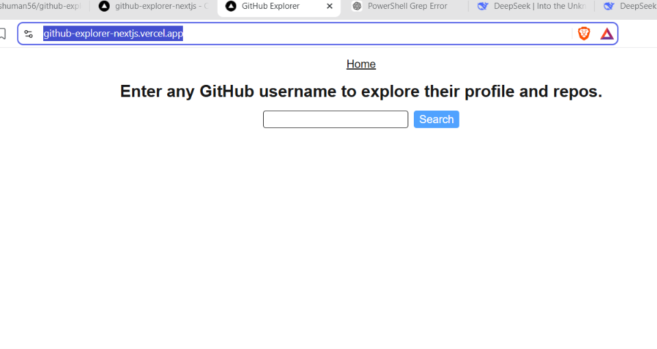

# GitHub Explorer NextJS

You can enter any github username in the input and when you click the search button you get that user and there repos. And when you enter the username that not there it will give you and error message.

[Live Demo](https://github-explorer-nextjs.vercel.app/)

[React Demo](https://github-explorer-ts-drab.vercel.app/)



## Features

- You just enter username and it will give information like name, bio and photo.
- You can also see there repos in the format like name, description and language.

## Tech Stack

Built with NextJS.

## What I Learned

I read the docs from NextJS website. But there are so many doubts about why we need server segment and clint segment. How the error page show when there is an error and many more..

## How to Run It Locally

```bash
git clone https://github.com/Anshuman56/github-explorer-nextjs
cd github-explorer-nextjs
npm install
npm run dev
```

## Backend code

There is no backend I only use the Github API.
